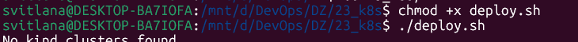
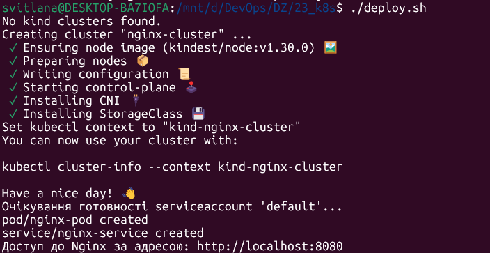
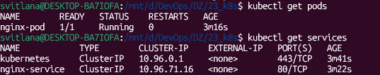
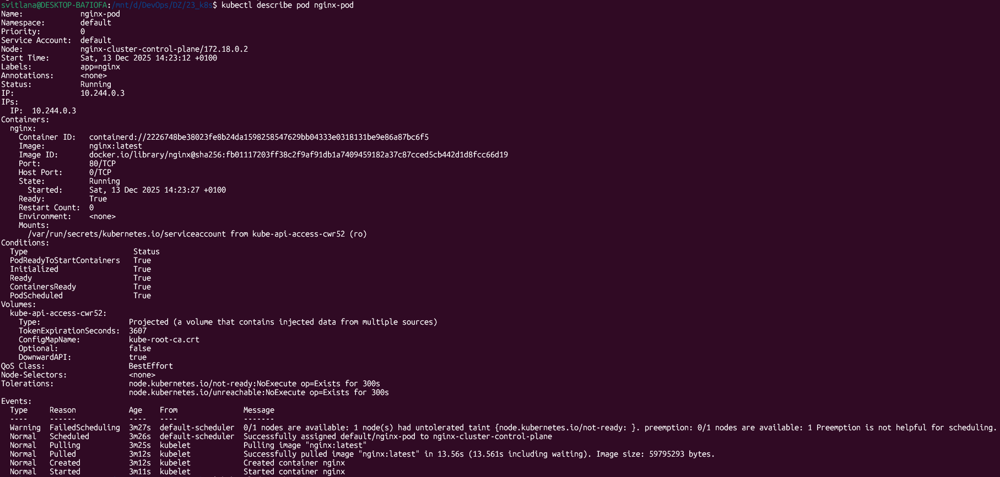
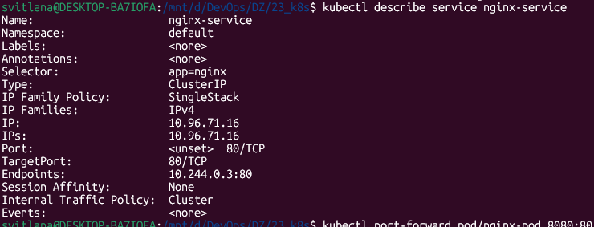
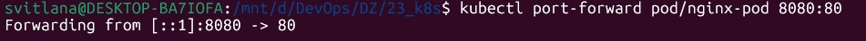
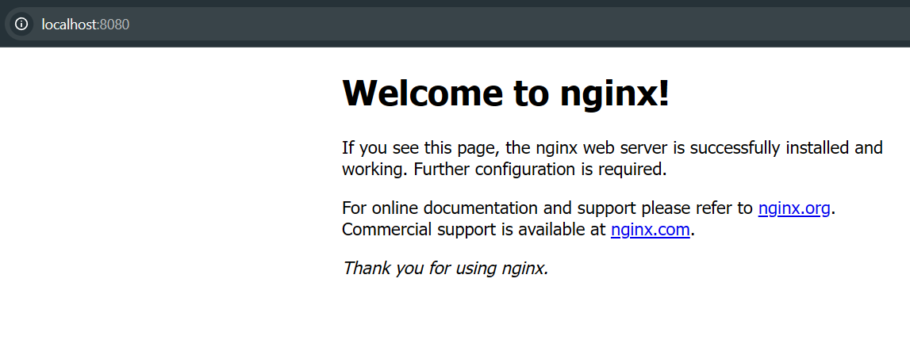
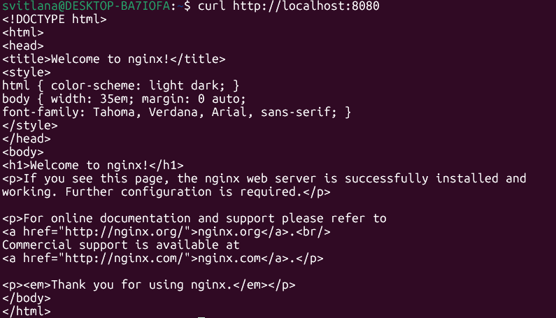
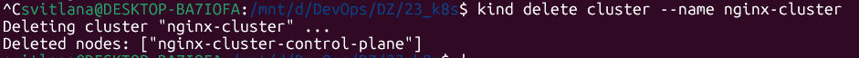

# Kubernetes Homework

## Основна інформація про проєкт

Цей проєкт демонструє базову роботу з Kubernetes у локальному середовищі (WSL2 + kind):
- Створення кластера Kubernetes за допомогою kind
- Деплой pod з nginx
- Відкриття доступу до nginx через Service
- Автоматизація деплою через bash-скрипт

## Інсталяція KIND у WSL2

Детальна інструкція з встановлення KIND у WSL2 знаходиться тут: [docs/kind-windows-wsl2.md](docs/kind-windows-wsl2.md)

## Опис структури проєкту

Детальний опис структури проєкту та призначення основних файлів: [docs/project-structure.md](docs/project-structure.md)

---

## Приклад виконання скрипта



## Скріншот результату запуску у WSL



---

## Перевірка після деплою

> **kubectl get pods / get services:**
>
> 

> **kubectl describe pod nginx-pod:**
>
> 

> **kubectl describe service nginx-service:**
>
> 

---

## Додатково: port-forward для доступу до nginx

У середовищі Windows + WSL2 + kind port-forward — це стандартний і рекомендований спосіб отримати доступ до сервісів у кластері.

Виконайте у WSL:
```bash
kubectl port-forward pod/nginx-pod 8080:80
```

- Ця команда відкриє локальний порт 8080 і направить трафік напряму у pod на порт 80.
- Після запуску port-forward не закривайте це вікно терміналу.

В іншому вікні WSL перевірте доступність nginx:
```bash
curl http://localhost:8080
```

Якщо ви побачите HTML-код сторінки nginx — все працює!

---

## Важливо про port-forward у WSL2 + kind

> **ВАЖЛИВИЙ МОМЕНТ (професійний):**
>
> `kubectl port-forward` — це не “обхідний шлях”, а стандартний, рекомендований інструмент для локальної розробки з Kubernetes.
>
> Його активно використовують DevOps, SRE, Kubernetes maintainers і він описаний у офіційній документації Kubernetes.
>
> **Приклад виконання port-forward:**
>
> 
>
> **У випадку Windows + WSL2 + kind:**
> - port-forward — це єдиний правильний, стабільний і очікуваний варіант доступу до сервісів у кластері.
> - У середовищі Windows + WSL2 VM не має bridge IP, тому прямий доступ до NodePort/ClusterIP з Windows неможливий.
> - Доступ до pod/service можливий лише через `kubectl port-forward`.

---

## Результати: доступ до nginx

> **Скріншот сторінки nginx у браузері:**
>
> 

> **Скріншот перевірки через curl у WSL:**
>
> 

---

## Видалення кластера kind

Після завершення роботи кластер можна видалити для звільнення ресурсів:

Виконайте у WSL:
```bash
kind delete cluster --name nginx-cluster
```

> **Скріншот видалення кластера:**
>
> 

---


